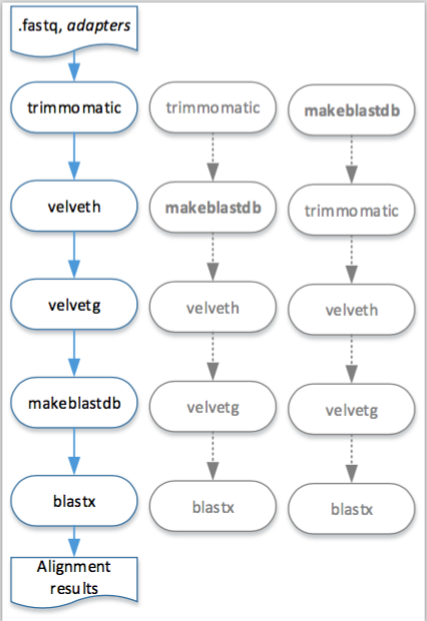
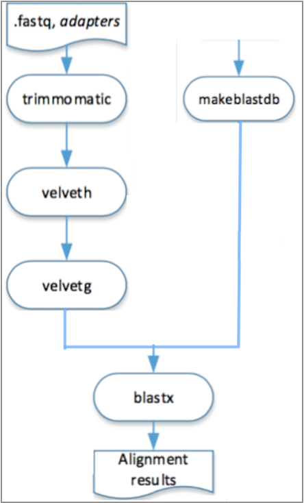
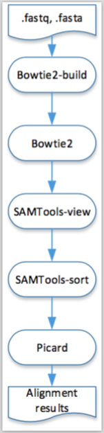

#  NGSPipes DSL

The NGSPipes DSL is a domain specific language for describing pipelines. The syntax is described following a EBNF notation alike. As a programming language, it has some primitive building blocks with the expressiveness to define data processing, namely flow processing can be modeled as a direct acyclic graph. These primitives are defined by syntactic and semantic rules which describe their structure and meaning respectively. 
The primitives and the full syntax will be presented in this section. For further explaining the expressiveness of each primitive, we also incrementally introduce an example in this section, as well as the full example.

## Primitives

The primitives of NGSPipes DSL are  `Pipeline`, `tool`, `command`, `argument` and `chain`. In the folowing subsections it will be introduced the purpose of this primitives, ilustrating with some examples.

###  Pipeline

Since a `Pipeline` is composed by the execution of one or more tools, it must be defined the tools repository, i.e., all the information necessary with respect to the available tools. To define this repository in the pipeline it is necessary to identify not only where it is stored, but also the type of storage (localy ou remotely, like github) to know how to process that information. In Example 2.1 is depicted a part of a pipeline specification.


```javascript  
Pipeline "Github" "https://github.com/ngspipes/tools"{ 
```
**Example 2.1: A partial pipeline specification, using a remote repository.**

In the example of listing 2.1, "Github" is the repository type and "https://github.com/ngspipes/tools" is the location of the tool repository.
The case of being a local repository is very similar, as it can be observed in Example 2.2.

```
Pipeline "Local" "E:\ngspipes" {
```
**Example 2.2: A partial pipeline specification, using a local repository.**

In the previous example, the tool repository is on the directory named as "ngspipes", found at drive "E:".
Formally,  the pipeline must follow the grammar in Listing 2.1.

``pipeline: ’Pipeline’ repositoryType repositoryLocation ’{’ (tool)+ ’}’ ;``

**Listing 2.1: Partial specification of the DSL grammar: pipeline specification grammar** 


In Listing 2.1, `(tool)+` represents that a pipeline is composed by the execution of one or more tools (notice that, as will be further explained, the tool execution may include the execution of one or more commands).

### tool

Each tool is specified in the pipeline by its name, its configuration file name (without extension) and by the set of commands within the tool that will be executed within this pipeline. For instance, in Example 2.3 the pipeline is composed only by one tool, which only includes a command.

```
javascript
Pipeline "Github" "https://github.com/ngspipes/tools" {
  tool "Trimmomatic" "DockerConfig" {
    command "trimmomatic" {
      argument "mode" "SE"
      argument "quality" "-phred33"
      argument "inputFile" "ERR406040.fastq"
      argument "outputFile" "ERR406040.filtered.fastq"
      argument "fastaWithAdaptersEtc" "adapters/TruSeq3-SE.fa"
      argument "seed mismatches" "2"
      argument "palindrome clip threshold" "30"
      argument "simple clip threshold" "10"
      argument "windowSize" "4"
      argument "requiredQuality" "15"
      argument "leading quality" "3"
      argument "trailing quality" "3"
      argument "minlen length" "36"
    }
   }
  }
```
**Example 2.3: A pipeline specification composed only by one tool, including only one command.** 

The tool configuration file name  in Listing 2.4 is "DockerConfig", _i.e._, it must exist in the tool repository "https://github.com/ngspipes/tools", within the tool information "https://github.com/ngspipes/tools/tree/master/Trimmomatic" (notice that this repository structure is directory based, as explained in https://github.com/ngspipes/tools/wiki), a configuration file named "DockerConfig", with JSON Format. This file must define a JSON object with the property `builder` set as "DockerConfig". In this case, this JSON file is https://github.com/ngspipes/tools/blob/master/Trimmomatic/DockerConfig.json.
With this information together with the repository information, the environment for executing the Trimmomatic command is specified.

### command

As mentioned before, there may exist a set of commands within the tool that should be executed within a pipeline. Example 2.4 depicts an example with this feature.

```javascript
Pipeline "Github" "https://github.com/ngspipes/Repository" {
  tool "Trimmomatic" "DockerConfig" {
    command "trimmomatic" {
      argument "mode" "SE"
      argument "quality" "-phred33"
      argument "inputFile" "ERR406040.fastq"
      argument "outputFile" "ERR406040.filtered.fastq"
      argument "fastaWithAdaptersEtc" "adapters/TruSeq3-SE.fa"
      argument "seed mismatches" "2"
      argument "palindrome clip threshold" "30"
      argument "simple clip threshold" "10"
      argument "windowSize" "4"
      argument "requiredQuality" "15"
      argument "leading quality" "3"
      argument "trailing quality" "3"
      argument "minlen length" "36"
    }
  }
  tool "Velvet" "DockerConfig" {
    command "velveth" {
      argument "output_directory" "velvetdir"
      argument "hash_length" "21"
      argument "file_format" "-fastq"
      chain "filename" "outputFile"
    }
    command "velvetg" {
      argument "output_directory" "velvetdir"
      argument "-cov_cutoff" "5"
    }
  }
```
**Example 2.4: A pipeline specification composed by more than one tool and more than one command.** 

In example depicted in Example 2.4, the pipeline will run two tools, where the second one executes two commands of the Velvet tool, namely `velveth`and `velvetg`.

Therefore, the tools specification must follow the grammar presented in Listing 2.2.

``tool: 'tool' toolName configurationName '{' (command)+ '}' ``

**Listing 2.2:  Partial specification of the DSL grammar: tool specification grammar**

In Listing 2.2 `(command)+` represents that there may exist set of commands with at least a command, within the tool that should be executed within a pipeline.

For executing each command, it is necessary to identify its name, which is unique in the tool context and to set the values for each required parameters (optional parameters may not be specified). We refer the command parameters in NGSPipes language as  _arguments_, since we only specify in the pipeline the parameters which we have values to set. For instance,
in the previous pipeline example, the argument `filename` of the command `velveth` has as value `-fastq`, _i.e._, the input file for this command has a FASTQ format.

Thus, the command specification must follow the grammar in Listing 2.3.

``command : 'command' commandName '{' (argument | chain)+ '}' ``;

**Listing 2.3:  Partial specification of the DSL grammar: command specification grammar**


In Listing 2.3  `(argument | chain)+`
represents that there may exist a list of arguments within this command as well as a list of chains. Chain is also a primitive in NGSPipes, as we will further explain in the subsection _chain_.

### argument

As defined in the previous example, the argument definition has the syntax
presented in Listing 2.4.

``argument : 'argument' argumentName argumentValue ``;

**Listing 2.4: argument syntax.**

For instance, in the previous pipeline specification the `format_file` is an argument for the `velveth` tool, namely:
```javascript
argument "file_format" "-fastq"
```

### chain

 The `chain` primitive  allows to set an argument of a command with the produced output of other command.
Sometimes the produced output is returned as files with names given internally by the command. Alternatively the output files name may be given explicitly as an argument to the command.
In both situations, it is common that other commands use these output files for continue processing the pipeline. For instance,
consider the following example:

```javascript
Pipeline "Github" "https://github.com/ngspipes/Repository" {
  tool "Trimmomatic" "DockerConfig" {
    command "trimmomatic" {
      argument "mode" "SE"
      argument "quality" "-phred33"
      argument "inputFile" "ERR406040.fastq"
      argument "outputFile" "ERR406040.filtered.fastq"
      argument "fastaWithAdaptersEtc" "adapters/TruSeq3-SE.fa"
      argument "seed mismatches" "2"
      argument "palindrome clip threshold" "30"
      argument "simple clip threshold" "10"
      argument "windowSize" "4"
      argument "requiredQuality" "15"
      argument "leading quality" "3"
      argument "trailing quality" "3"
      argument "minlen length" "36"
    }
 }
  tool "Velvet" "DockerConfig" {
    command "velveth" {
      argument "output_directory" "velvetdir"
      argument "hash_length" "21"
      argument "file_format" "-fastq"
      chain "filename" "outputFile"
    }
    command "velvetg" {
      argument "output_directory" "velvetdir"
      argument "-cov_cutoff" "5"
    }
  }
  tool "Blast" "DockerConfig" {
    command "makeblastdb" {
      argument "-dbtype" "prot"
      argument "-out" "allrefs"
      argument "-title" "allrefs"
      argument "-in" "allrefs.fna.pro"
    }
    command "blastx" {
      chain "-db" "-out"
      chain "-query" "Velvet" "velvetg" "contigs_fa"
      argument "-out" "blast.out"
    }
  }
}
```

**Example 2.5: A pipeline specificaton using the chain primitive.**

As it can be seen in Example 2.5, in command `blastx`, the argument `query` receives as value the file ``contigs_fa'', which is an output of the command \verb+velvetg+ of the tool `velvet` (notice that in this case, the name of the file is given internally by the command). 

The primitive `chain` has a simplified version, which can be used when the output is from a the previous command in the pipeline specification. In this case, we only specify the name of the output file to chain with the given argument. As an example, we can see the argument `filename` of the `velveth` command chained with the output file, named as `outputFile`, of the  command `trimmomatic`. 

A last version of the primitive `chain` is when the name of the tool can be omitted, but it is necessary to specify the name of the command, of the argument and also the output. This apply to cases where the chain occurs between two commands of the same tool.

Thus, the chain specification must follow the grammar depicted in Listing 2.5.

``chain : 'chain' argumentName ( ( toolName )? commandName)? outputName ``;

**Listing 2.5:  Partial specification of the DSL grammar: chain specification grammar**

## Full NGSPipes DSL syntax

In Listing 2.6 is depicted the full NGSPipes DSL grammar.

``pipeline: 'Pipeline' repositoryType repositoryLocation '{' (tool)+ '}' `` ;

``tool: 'tool' toolName configurationName '{' (command)+ '}' ``;

``command : 'command' commandName '{' (argument | chain)+ '}' ``;

``argument : 'argument' argumentName argumentValue ``;

``chain : 'chain' argumentName ( ( toolName )? commandName)? outputName ``;

``repositoryType : String ``;

``repositoryLocation : String ``;

``toolName : String ``;

``configurationName : String ``;

``commandName : String ``;

``argumentName : String ``;

``argumentValue : String ``;

``outputName : String ``;

``toolPos: Digit ``;

``commandPos : Digit ``;

``String : ’"’ (ESC | ~["\\])* '"' ``;

``Digit : [0-9]+ ``;

``fragment ESC : '\\' (["\\/bfnrt] | UNICODE) ``;

``fragment UNICODE : 'u' HEX HEX HEX HEX``; 

``fragment HEX : [0-9a-fA-F]``;

``WS : [ \t\r\n]+ -> skip`` ;

**Listing 2.6: Specification of the NGSPipes Full DSL grammar.**

## Examples

###  A pipeline used on epidemiological surveillance 

In this section we present a pipeline used on epidemiological surveillance.

```
Pipeline "Github" "https://github.com/ngspipes/tools" {
  tool "Trimmomatic" "DockerConfig" {
    command "trimmomatic" {
      argument "mode" "SE"
      argument "quality" "-phred33"
      argument "inputFile" "ERR406040.fastq"
      argument "outputFile" "ERR406040.filtered.fastq"
      argument "fastaWithAdaptersEtc" "adapters/TruSeq3-SE.fa"
      argument "seed mismatches" "2"
      argument "palindrome clip threshold" "30"
      argument "simple clip threshold" "10"
      argument "windowSize" "4"
      argument "requiredQuality" "15"
      argument "leading quality" "3"
      argument "trailing quality" "3"
      argument "minlen length" "36"
    }
 }
  tool "Velvet" "DockerConfig" {
    command "velveth" {
      argument "output_directory" "velvetdir"
      argument "hash_length" "21"
      argument "file_format" "-fastq"
      chain "filename" "outputFile"
    }
    command "velvetg" {
      argument "output_directory" "velvetdir"
      argument "-cov_cutoff" "5"
    }
  }
  tool "Blast" "DockerConfig" {
    command "makeblastdb" {
      argument "-dbtype" "prot"
      argument "-out" "allrefs"
      argument "-title" "allrefs"
      argument "-in" "allrefs.fna.pro"
    }
    command "blastx" {
      chain "-db" "-out"
      chain "-query" "Velvet" "velvetg" "contigs_fa"
      argument "-out" "blast.out"
    }
  }
}
```
**Example 2.6: A pipeline used on epidemiological surveillance.**

A visual representation of the pipeline described in Example 2.6 is presented in the Figure 2.1. Moreover, in this figure is also possible to observe other execution orders that are feasible to execute this pipeline in the engine for workstation.



**Figure 2.1: Visual representation of the execution, in the engine for workstation, of the pipeline described in Example 2.6.**

In the engine for cloud, different steps of the pipeline can be  executed in different machines, it is only necessary to respect its depedencies, as it is shown in the Figure 2.2.




**Figure 2.2: Visual representation of the execution, in the engine for cloud, of the pipeline described in Example 2.6.**

### A pipeline used on ChiP-Seq analysis 

In this section we present a pipeline used on ChiP-Seq analysis.

```
Pipeline "Github" "https://github.com/ngspipes/tools" {
	tool "Bowtie2" "DockerConfig" {
		command "bowtie2-build" {
			argument "reference_in" "sequence.fasta"
			argument "bt2_base" "sequence"
		}
	}
	tool "Bowtie2" "DockerConfig" {
		command "bowtie2" {
			argument "-U" "SRR386886.fastq"
			argument "-x" "sequence"
			argument "--trim3" "1"
			argument "-S" "eg2.sam"
		}
	}
	tool "SAMTools" "DockerConfig" {
		command "view" {
			argument "-b" "-b"
			argument "-o" "eg2.bam"
			chain "input" "-S"
		}
	}
	tool "SAMTools" "DockerConfig" {
		command "sort" {
			argument "-o" "eg2.sorted.bam"
			chain "input" "-o"
		}
	}
	tool "Picard" "DockerConfig" {
		command "MarkDuplicates" {
			chain "INPUT" "-o"
			argument "OUTPUT" "marked_duplicates.bam"
			argument "REMOVE_DUPLICATES" "true"
			argument "METRICS_FILE" "metrics.txt"
		}
	}
}
```
**Example 2.7: A pipeline used on ChiP-Seq analysis.**

A visual representation of this pipeline is presented in the next figure.



**Figure 2.3: Visual representation of the execution, in both engines, of the pipeline described in Example 2.6.**

### A pipeline using listing tools (for executing only with Engine for Cloud)

### A pipeline using split and join tools (for executing only with Engine for Cloud)
