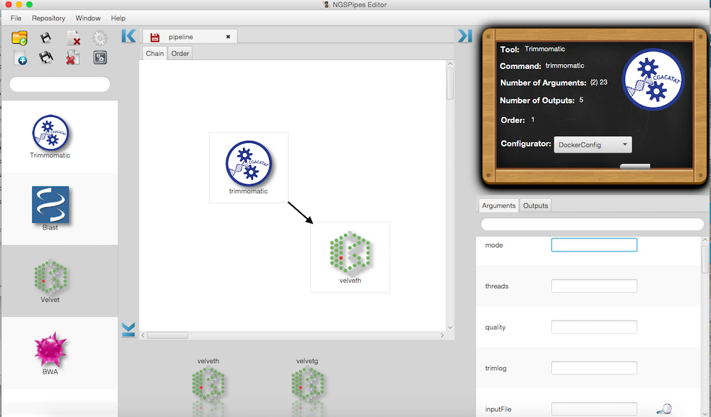
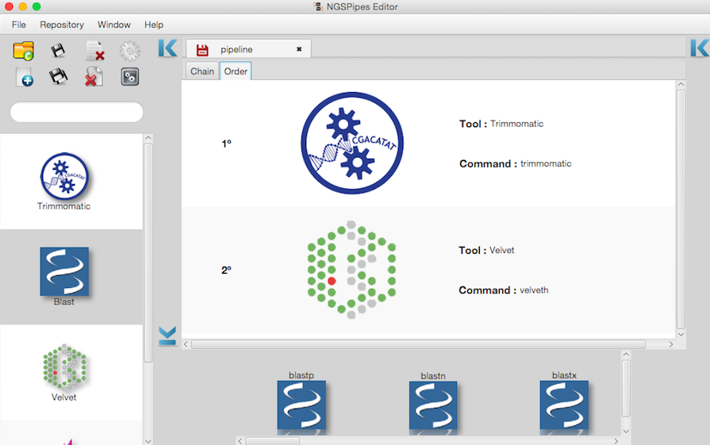

# NGSPipes Editor

The NGSPipes Editor is a user-friendly editor for graphically define pipelines. Using this editor is very simple to define each processing step of the pipeline (i.e. a command) as well as the data to be used at each step (i.e., arguments). 

The following sections show how to use the editor. 


## Download NGSPipes Editor


The NGSPipes Editor is a Java Application. To deploy this it in your system you need:

*  Java Runtime Environment (JRE), version 8, which can be obtained from [here](http://www.oracle.com/technetwork/java/javase/downloads/jre8-downloads-2133155.html).

Download the editor from [here](https://github.com/ngspipes/editor/releases).

## Execute NGSPipes Editor

To run the editor, and uncompress the downloaded file. Then
you should have the following file tree:
```
 |-- editor-1.0\
       |-- bin\
          |-- editor        (CUI OSX/Linux run script)
          |-- editor.bat    (CUI Window run script)
       |-- lib\
          |-- ...
```
Then you can simple double click on corresponding script.

If you have OSX and you you prefer the double click version to run the editor, it may appears, only the first time after you double click it, the following info:


**Figure 1**

Then, go to  "System Preferences" and choose "Security and Privacy"


**Figure 2**

Then select the button "Open anyway"


**Notice that depending on the MAC OS version, it may be necessary to unlock to make changes and to select the option "Allow apps downloaded from Anywhere"**

 
**Figure 3**
 
 The initial GUI that appears from editor is the following:
 


**Figure 4**

In the following sections it will be explained how to use the editor. 
Moreover, in the editor's menu, selecting `help` and then the menu item `about`, it is possible to find some tutorial videos to help to use NGSPipes Editor.

## NGSPipes Editor Sections

When defining a new pipeline (we will explain how to define a new pipeline in the Section [5](#head5)),  the editor environment will appear similar to one of Figures 5 and 6 (it depends on the edition that is being performed). 


**Figure 5**



**Figure 6**


The NGSPipes Editor is composed of 5 sections: utilities; repository; tools; commands; pipeline and menu bar.
These sections are pointed out in Figure 7.


**Figure 7**

The **utilities section** includes all the buttons for executing the utilities actions, such as saving the active pipeline, closing it and generate the final version, when in this last case the user is asked to define the input and output directory ((see Section [6](#head6) for more information on pipeline generation). There are also in this section similar buttons for applying these actions for more than one workflow at the same time. Moreover, it is also in this section that exists a button for creating a new pipeline (see Section [5](#head5) for more information).

More specifically,

*  `New` button - Create a new pipeline;
*  `Open` button - Open an existent pipeline;
* `Save` button - Save the active pipeline;
* `Save All`button - Save all the open pipelines;
* `Close` button - Close the active pipeline;
* `Close All` button - Close all the open pipelines;
* `Generate` button - Generate the pipeline in the NGSPipes language, _i.e._, generate the file with extension `.pipes` for the active pipeline. This file is essential for executing the pipeline with the NGSPipes Engine (see https://github.com/ngspipes/engine/wiki for more information). With this action, the user is asked for defining the input and output directory. It is asked if it is allowed to copy the input files that are not already in the Input directory. 
* `Generate All` button - Generate all the files with extension `.pipes` for all the active pipelines. For each pipeline it is applied the action of the `Generate` button. 


## Select the tools repository

When the Editor starts, it loads a local repository that is included within the tool. However, user can select other repository, either local or remote. To select other repository, go to the menu `Repository` and select `Change repository`.
In the version 1 of the Editor, there are four types that are supported, as depicted in Figure [8](#fig8).


**Figure 8**

The `Default` is a local repository that is included within the tool. To specify other local repositories, it is necessary to select the `Local` option and, with the `search button`, select the path to the repository. Instead, to specify a remote one, it is necessary to select one of the following options, `github or uribased`, depending on the type of the remote repository. For instance with the tools' repository example, namely https://github.com/ngspipes/tools, please select the option `github`, with the URL `https://github.com/ngspipes/tools`.

Then, it is possible to observe the **repository section** on Figure [9](#fig9). 


**Figure 9**

In the **repository section**, the user may explore all the tools that are available on the repository, as well as filter them by name. It is also possible to obtain the description of a tool if we place the mouse over the tool's logotype. Selecting a tool, will open the **tool section** (in Figure [5](#fig5), Velvet is selected and the tool section is at the bottom, centered), where is possible to navigate over all the commands available within that tool. In some cases, the tool has only one command, as for instance the Trimmomatic tool. It is also possible to obtain the description of each command similarly as done for obtaining the tool description. In these sections, the user may obtain more information about a given tool, command, input or output, only by selecting a given item of one of these sections with the right button of the mouse and selecting the Description option. This option opens a new window with all the information available on the repository, as depicted in Figure [10](#fig10).


**Figure 10**

The other sections, namely the **pipeline** and **command** sections will be detailed in section [5](#head5).

## Creating a new Pipeline

In order to create a new pipeline, after selecting the ` tools' repository`, please select the button with a plus (in the utilities section) or go to the menu `File` and select the option `new`.


**Figure 11**


After defining the directory where the pipeline is kept and the name of the pipeline, it will appear the **pipeline section**, as depicted in the following Figure.


The pipeline creation generates a file with extension `.wf`. This file keeps all information of a pipeline within the editor, not only the commands as well as the visual positions of the pipeline within the editor.

**Figure 12**

The **pipeline section** has two panels, the _chain_ and the _order_ panel. 
In the _chain_ panel, the user can add or remove commands as well as set arguments and chains. For instance, in (Figure [5](#fig5)) it was defined a chain between the `trimmomatic command` and the `velveth command` since the output file of the first one is an input file of the second one.
For more information about chains, please see https://github.com/ngspipes/dsl/wiki.
Before defining the chain, it is necessary to add the commands to execute within the pipeline. Adding a new command to the `chain panel` (notice that is necessary to previously select the tool in the `repository section` and then in the `tool section` select the command) is simply done by a _drag and drop_ action.


 After adding a command and double clicking on it, it appears the **command section** (see the right size of Figure [5](#fig5)). This section only appears when the user does a double click on a command over the _chain_ panel. In the **command section**,  the user can set the arguments of the selected commands as well as to confirm its generated output file names. 

For defining the chain between two commands, it is necessary to drag the **blue icon** that appears in the command image within the `chain` panel, after a double click.


**Figure 13**

Then it is necessary to select the **blue icon** and drag it to the command to which is to do the chain operation. After that, it will appear the following figure:


**Figure 14**

Here it is necessary to select the output to be chained as an argument to the other tool. After that, it is necessary to click on the *blue icon* and the chain action will be set and a black arrow will appear between both tools (see next Figure).


**Figure 15**


After setting the required arguments of all commands added to the pipeline and setting all the chains,
the user can observe in the _order_ panel one of the possible inferred orders of the pipeline execution (see Figure [6](#fig6)). This order is given, assuring that command dependency and priority are preserved. For more information about command dependency and priority, please see https://github.com/ngspipes/tools/wiki. 

Moreover, in the editor's menu, selecting `help` and then the menu item `about`, it is possible to find some tutorial videos to help to use NGSPipes Editor.

## Generate the final pipeline version to execute

As mentioned before, creating a new pipeline generates a file with extension `.wf` and with the name chosen by the user. This file keeps all information of a pipeline within the editor, not only the commands as well as its visual positions.

However, if the user wants to execute the pipeline in the NGSPipes Engine (https://github.com/ngspipes/engine/wiki), it is necessary to produce a file with extension `.pipes`. This file is written using the NGSPipes language (https://github.com/ngspipes/dsl/wiki) and thus does not have visual information. For producing the file with extension `.pipes` it is necessary to select the generate button or go to `File -> Generate pipeline`.

## Loading an existing pipeline

To load an existing pipeline, it is necessary to go to `File -> Open` and choose a pipeline file (with extension `.wf`) or select the open button.

## Multiple loaded pipelines

It is possible to have multiple loaded pipelines, but just one is active.


## Error Reporting

Each argument of a command of a given tool has a type and may be or not optional. The required arguments (not optional)
appears in a red box.
The type of each argument must be one of the following: integer number; file; text; real number or a directory. When the user assigns an incompatible type to a given argument, the editor will generate an error message to report that situation. An example of this situation is depicted in the following figure:


If the user does not set a compatible value to a required argument, the editor will also
generate an error message to report that situation, when generating the pipeline specification (pressing the generate button). 


## Multiple inputs

The tools can produce multiple outputs. These tools also might require multiple inputs coming from different tools or the same tool. When the multiple inputs are from the same tool, NGSPipes supports it by adding a numbered label on the arrow.
This functionality is depicted in the following figure:


Notice that this label is only visible when one of the tools is selected.
