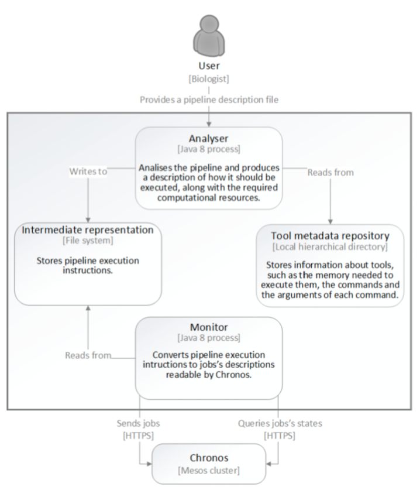

# Engines

Our framework offers two engines. Based on the same definition and the same tool’s repository, a pipeline can be put to run either on the workstation or on a compatible cloud environment. Both engines analyse the pipeline description and transformation it to an executable format, determining resource requirements of each tool based on the tool configuration present in the repository. 

## Engine for workstation

The _NGSPipes engine for workstation_ starts with a pipeline description and transform it into a sequence of calls to the designated tools. After this, the _engine_ automatically configures and executes each tool in isolation from the remaining system environment (using a dedicated virtual machine).

The _NGSPipes engine for workstation_ is available in two flavors: a command line user interface (CUI) and a graphic user interface (GUI). The first is ideal to use when running on remote servers (either physical or deployed as virtual machines in the cloud), although it can also run locally. The second one can be used in systems where a graphical display is available.

The following sections shows how to run the engine. To build from source code please follow the instructions in subsection "Instructions to build NGS Pipes Engine from source code".


### Requirements to run the engine for workstation

The machine where _engine_ is to be executed needs the following tools:

* Java 8 Development Kit (http://www.oracle.com/technetwork/java/javase/downloads/jdk8-downloads-2133151.html).
* VirtualBox version >= 5.0 (https://www.virtualbox.org/wiki/Downloads). NOTE: Ensure the command `VBoxManage` can be found by the *command line* of your operating system.

### Install engine for workstation

The _engine_ is made of a regular Java application and a VirtualBox's compliant image (also identified as _executor_). To deploy this in your system:

1. Download [engine-2.0-zip](http://link.inesc-id.pt/pipes/engine-2.0.zip) from our file server and uncompress to a working directory (`WD`)
1. Download the _executor_ image from [here](http://link.inesc-id.pt/pipes/NGSPipesEngineExecutor.zip) and uncompress to your work directory (`WD\engine-1.0\`)
1. Follow the instructions bellow to either run in a system in a _console_ or with a _graphical interface_.

After these steps you should have the following file tree:

```
  WD
    |-- engine-1.0\
       |-- NGSPipesEngineExecutor\ 
          |-- NGSPipesEngineExecutor.vbox
          |-- NGSPipesEngineExecutor.vdi
       |-- bin\
          |-- engine        (CUI OSX/Linux run script)
          |-- engine.bat    (CUI Window run script)
          |-- engine-ui     (GUI OSX/Linux run script)
          |-- engine-ui.bat (GUI Window run script)
       |-- lib\
          |-- ...
    |-- (other files, e.g. the pipeline description)

```

###  Run the Engine for workstation

The engine is provided as a console application or a graphical user interface application.

#### command line tool

This is a regular Java application packed as a JAR file. To run, use the following command line at the working directory (`WD`):

##### Windows:

``c:\WD>engine-1.0\bin\engine.bat <mandatory arguments> [<optional arguments>]``

##### OSX/Linux

``user@machine:/home/WD$ engine-1.0/bin/engine <mandatory arguments> [<optional arguments>]``

##### Parameters

* The command line tool has the following mandatory parameters :

`-pipes` <arg>      Relative ou absolute path of the pipeline description (mandatory). This file must be a .pipes extension file, where the pipeline is written using the NGSPipes language.

`-in` <arg>         Absolute path at the user machine where the input data files are located (mandatory).

`-out` <arg>        Absolute path at the user machine where the output data file will be placed (mandatory).

* The command line tool has the following *optional* parameters :

 `-cpus` <arg>       Assigned cores. Default is 2 CPUs.

 `-mem` <arg>        Assigned memory (in Gigabytes). If not present, the number of gigabytes allocated to the engine will be inferred by analyzing the tools in the pipeline.  

 `-from` <arg>       Initial pipeline step. If not present, the first step will be executed.

 `-to` <arg>         Final pipeline step. If not present, the pipeline will execute all the steps.

 `-executor` <arg>   Executor image name. If not present, uses the image located at WD/NGSPipesEngineExecutor.

##### Example

A small example with only manadatory arguments (a more complete description is presented in the subsection "Use case".

```
  engine-1.0/bin/engine -in /home/ngs/inputs -out /home/ngs/outputs -pipes pipeline.pipes
```

##### Error reporting 

The next figure shows an error report from the pipeline engine when executing a pipeline where a mandatory argument is not specified.


The next figure shows an error report from the pipeline engine when executing a pipeline where an argument is uses with a non-compatible value type, according to the tool's specification.


#### User interface tool

The GUI version of the _NGSPipes Engine for workstation_ allows the same operations but using a graphical interface. When installed at a working directory (`WD`), the tool can be executed in the file explorer of your operating system:

##### Windows

``WD\engine-1.0\bin\engine-ui.bat``

##### OSX/Linux

``WD/engine-1.0/bin/engine-ui``


If you have OSX and you you prefer the double click version to run the editor, it may appears, only the first time after you double click it, the following info:


**Figure 1**

Then, go to  "System Preferences" and choose "Security and Privacy"


**Figure 2**

Then select the button "Open anyway"


 
**Figure 3**
 
**Notice that depending on the MAC OS version, it may be necessary to unlock to make changes and to select the option "Allow apps downloaded from Anywhere**
 

##### Screen shots

The following image shows a screenshot of the main windows and a short description of each button. 


There are two main tabs: **Recent pipelines** and **Engines**. The **Recent pipelines** tab lists the last pipelines loaded by the application. It also allows the configuration of parameters for a selected pipeline. The **Engines** tab shows the previously used instances. In each engine, different tools can already be installed. The user can choose which instance to execute based on his knowledge of the pipeline.

##### Load pipeline

When loading a pipeline the user chooses the file with the pipeline description, the directory at the user's computer where the results are to be written and the path from where the data is to be loaded. The user can also choose which engine instance to use.


#### Configure pipeline

When a pipeline description in already loaded by the UI, several execution parameters can be changed: paths, engine instance, memory and number of cores.


##### Execute pipeline

When an engine instance is selected and the "Run Pipeline" button is pressed, the UI will show the following window, where output information regarding the execution steps are presented.


##### Error reporting

Errors can occur during the execution of a pipeline. For example, the next figure shows an error related to a mandatory argument that is not specified.


The next figure shows an error related to a mismatch between the type of value used in the pipline and the type of parameter that is present in the specification of the tool.


####  Use case

The following use case executes the pipeline described in the [DSL section](https://github.com/ngspipes/dsl/wiki#head3) using the console version of *NGSEngine*. The tools' repository used in the pipeline is [https://github.com/ngspipes/repository](https://github.com/ngspipes/repository). It has metadata for the tools *Trimmomatic*, *Velvet* and *Blast*.

* Check if requirements are met and that the engine and executor image are installed.
* Download the pipeline [here](https://link.inesc-id.pt/pipes/example/pipeline.pipes) and save it as `pipeline.pipes` to the working directory. The following examples assume the working directory is `c:\ngspipes`.
* Download the input data [sample](https://link.inesc-id.pt/pipes/example/) and place it at `inputs` directory (other name can be chosen). This data set comes from the [NCBI SRA](http://trace.ncbi.nlm.nih.gov/Traces/sra/?run=ERR406040), being part of a project on *deep sequencing within the Streptococcus pneumoniae antibiotic resistant pandemic clone PMEN1*. Extra information on how this data was obtained can be obtained [here](https://link.inesc-id.pt/pipes/data/).

After unziping file `ERR406040.fastq.zip` the directory content will look like:

```
c:\ngspipes\inputs
   |-- allrefs.fna.pro 
   |-- ERR406040.fastq
   |-- NexteraPE-PE.fa
   |-- TruSeq2-PE.fa
   |-- TruSeq2-SE.fa   
   |-- TruSeq3-SE.fa
   |-- TruSeq3-PE-2.fa
   |-- TruSeq3-PE.fa
   |-- TruSeq3-SE.fa 
```

* Create the `outputs` directory (`c:\ngspipes\outputs`)
* Execute the *engine* at your working directory using the following command line:

##### Windows
``c:\ngspipes>engine-1.0\bin\engine.bat -in c:\ngspipes\inputs -out c:\ngspipes\outputs -pipes c:\ngspipes\pipeline.pipes``

##### OSX/Linux
``ngs@server:/home/ngspipes$engine-1.0/bin/engine -in /home/ngspipes/inputs -out /home/ngspipes/outputs -pipes /home/ngspipes/pipeline.pipes``

##### Example and description of output messages

Initial steps of the output will look like this:

```
Loading engine directories
Loading engine resources
Using classpath C:/Users/user/NGSPipes/Engine/dsl-1.0.jar;
               C:/Users/user/NGSPipes/Engine/repository-1.0.jar
Getting engine requirements
Getting clone engine
Clonning engine
...... Clonning engine
...... Clonning engine
...... Clonning engine
...... Clonning engine
...... Clonning engine
...... Clonning engine
Configurating engine
Starting execute engine
Booting engine and installing necessary packages
...
```

Note that the cloning step only happens in the first execution of the engine. On the other hand, when a tool is used for the first in any *pipeline*, the engine will automatically download and install the corresponding Docker image. An example of output for when this is necessary is presented for the *Trimmomatic* tool:

```
...
TRACE    :: STARTED ::
TRACE   Running -> Step : 1 Tool : Trimmomatic Command : trimmomatic
INFO    Executing : sudo docker run -v /home/ngspipes/Inputs/:/shareInputs/:rw -v 
                            /home/ngspipes/Outputs/:/shareOutputs/:rw  
                        ngspipes/trimmomatic0.33 java -jar trimmomatic-0.33.jar SE 
                        -phred33 /shareInputs/ERR406040.fastq /shareOutputs
                        ERR406040.filtered.fastq  
                        ILLUMINACLIP:/shareInputs/adapters/TruSeq3-SE.fa:2:30:10
                        SLIDINGWINDOW:4:15 LEADING:3 TRAILING:3   MINLEN:36
INFO    Unable to find image 'ngspipes/trimmomatic0.33:latest' locally
INFO    latest: Pulling from ngspipes/trimmomatic0.33
INFO    511136ea3c5a: Pulling fs layer
INFO    e977d53b9210: Pulling fs layer
INFO    c9fa20ecce88: Pulling fs layer
...
INFO    6cf3f4911f80: Download complete
INFO    Digest: sha256:44f1dea760903cdce1d75c4c9b2bd37803be2e0fbbb9e960cd8ff27048cbb997
INFO    Status: Downloaded newer image for ngspipes/trimmomatic0.33:latest
INFO    TrimmomaticSE: Started with arguments: -phred33 /shareInputs/ERR406040.fastq 
                            / shareOutputs/ERR406040.filtered.fastq 
                            ILLUMINACLIP:/shareInputs/adapters/TruSeq3-SE.fa:2:30:10 
                            SLIDINGWINDOW:4:15 LEADING:3 TRAILING:3 MINLEN:36
...
```

Note that this tool was previously *dockerized* by the NGSPipes team. For other tools, such as Velvet or Blast, there is already public Docker images which the example pipeline uses. 

When the execution finish, the following files will be at the working directory:
```
c:\ngspipes\outputs
   |-- allrefs.phr
   |-- allrefs.pin
   |-- allrefs.psq
   |-- blast.out
   |-- filtered.fastq
   |-- velvetdir/
      |-- Log
      |-- Roadmaps
      |-- Sequences
      |-- contigs.fa
      |-- LastGrpah
      |-- stats.txt
```

##### Execution times

<a href="#exectimes"></a>

The above example was executed using several hardware configurations and operating systems. The pipeline was executed with the command line:

```
ngs@server:/home/ngspipes$engine-1.0/bin/engine -in /home/ngspipes/inputs
                          -out /home/ngspipes/outputs -pipes /home/ngspipes/pipeline.pipes
```

The folowing table shows execution times measured on *cold* and *warm* start situations. Cold start happens when the engine is executed the first time after installation. Warm start represents the situation when a pipeline is being re-executed and no updates are necessary to the tools.

| OS          | CPU                 | RAM (GB) | Disk | Cold start | Warm start |
|-------------|---------------------|----------|------|------------|------------|
| Windows 10  | Intel i5 @ 2.53 Ghz |    8     | SSD  |   39 min.  |   35 min.  |
| Windows 10  | Intel i7 @ 3.5 Ghz  |    16    | HDD  |   39 min.  |   30 min.  |
| OSX         | Intel(TM) i5 1.8Ghz |    8     | SSD  |   41 min.  |   38 min.  |

<sub>(*) [http://www.speedtest.net/](http://www.speedtest.net/)</sub>

As expected, a cold start takes an extra time because of intial setup and download of the tools used in the [pipeline](https://link.inesc-id.pt/pipes/example/pipeline.pipes). Warm start is the common execution scenario. These values can vary depending on:

* the size of the input data;
* the number of tools and commands used in pipeline;
* the input data and resources assigned to the execution image (CPU (`-cpus`) and memory (`-mem`)).


### Instructions to build NGS Pipes Engine for workstation from source code

#### Requirements 

No specific tools must be installed to build the _NGSPipes engine for workstation_. The code is available at git hub repository, which can be downloaded as a zip. 

The  source code repository can also be *cloned*. In the last case, the [git version control tool](https://git-scm.com/downloads) must be installed first.

#### Build commands

To build the _NGSPipes engine for workstation_ follow these steps:

* Download the zip or clone the [git repo](https://github.com/ngspipes/main) to your working directory. The following command will build all the components -- [DSL](https://github.com/ngspipes/dsl/wiki), [Tools repository](https://github.com/ngspipes/tools/wiki) and the [Engine](https://github.com/ngspipes/engine/wiki) (both console and UI version).
   * `cd main`
   * `git submodule init`
   * `git submodule update`
   * `gradlew build` (This will install [Gradle](http://gradle.org/whygradle-build-automation/), if necessary)
* To generate the `engine-1.0.zip` and `editor-1.0.zip` distributions files, run `gradlew distZip`, at `main` directory. The files will be located at the respective `build/distributions` directory.


## Engine for cloud

The Engine for cloud solution consists of two tools: the **analyser** and the **monitor**. 

The **analyser** inspects the given pipeline and, using the information stored in the tool meta-data repository, 
produces the instructions to execute the pipeline, along with the required computational resources for its execution.
These tool produces internally a graph of tasks, which reflects the dependency among the tasks and allows to infer what
 can be executed in parallel an what can only be executed in serie.
These instructions are then written to a file and locally stored, giving origin to an intermediate representation. 
The analyser tool can be simple executed in a workstation or in a cloud environment.

Given the pipeline representation produced by the Analyser tool, the **monitor** can be launched. 
The monitor tool is suitable for running in a cloud environment. 
It converts the intermediate representation into jobs' descriptions readable by [Chronos](https://mesos.github.io/chronos/) and, 
using Chronos's REST API, schedules them for execution. 
The tasks are deployed in a **cluster of machines** governed by the
[Mesos](http://mesos.apache.org/) batch job scheduling framework Chronos
Having launched the pipeline, the user can now query the system to know its current state. 
This results in a series of requests from the monitor to Chronos. When the pipeline finishes the execution, the user can make a request to the monitor to download its outputs.

We provide a **jar file with the analyser tool** and a **virtual machine with the monitor tool** for experimental
purposes, where users can simulate a cluster. With this machine, pipelines can be tested  without requiring a big amount
of computational ressources or an account in a cloud provider. Thus our solution can be tested in this virtual
machine or within a cloud provider, as described in the subsection "Install engine for cloud".

Next figure describes the main components of this engine and their interactions. More details on this engine can be found in this [report](https://gitlab.com/ngs4cloud/ngs4cloud/blob/36b53a7c40b07e5aac81c170f74b90d33bcdd4d6/docs/FinalReport.pdf).




### Requirements to run the engine for cloud

To run the **[analyser tool](http://tinyurl.com/h48zskc)**  you will need:

 - to have installed  [JRE 8](http://www.oracle.com/technetwork/java/javase/downloads/jre8-downloads-2133155.html).
 
To run the **monitor (within the virtual machine that we supply for testing)** you will need:

 - to have installed  [JRE 8](http://www.oracle.com/technetwork/java/javase/downloads/jre8-downloads-2133155.html).
 
 - virtualization software which supports vmdk files, like [VMware](http://www.vmware.com/) or [VirtualBox](https://www.virtualbox.org/).
 
 - To emulate the image is required 4GB of RAM and 1 CPU

To run the **monitor (without the virtual machine that we supply for testing)** you will need: 

  - a cluster with Chronos installed with the following requirements:
  		
  	- an endpoint to Chronos REST API;
  	
  	- Support for the execution od Docker jobs on all Mesos-Agents (Slaves);
  	
  	- A NFS acessible on all Mesos-Agents
  	
  	- SSH acess to a cluster machine that can interact with the cluster's NFS;
  	
  	

### Install the engine for cloud

#### Install the analyser 

To deploy this in your system:
 
 -  Create a new directory named Analyser and download the [jar](http://tinyurl.com/h48zskc) to there.
 
 
#### Install the monitor

To deploy this in your system:
 
 -  Create a new directory named Monitor and download the [jar](http://tinyurl.com/j22n92z) to there.

Normally to execute [monitor.jar](http://tinyurl.com/j22n92z)  one would need a cluster with the specifications mentioned above. 
**However to facilitate executing, for testing purposes, we provide a [Virtual Image](http://tinyurl.com/h8xg4n7) 
which emulates an appropriate cluster to execute monitor.jar.**
In a cloud environment, 
the setting will be similar, with the corresponding credentials.

Emulate the image of the cluster using a virtualization software which supports vmdk files, like 
[VMware](http://www.vmware.com/) or [VirtualBox](https://www.virtualbox.org/). 
To emulate the image **is required 4GB of RAM and 1 CPU**.

After launching the virtual machine, wait for the graphical environment and log in the desktop using the following
credentials: 

```
User: ngs4cloud
Pass: cloud123
```

Open a terminal and type the command 

```
/sbin/ifconfig
```
 and get the ip of Virtual Machine.

Now back to the host OS. If you try to execute the monitor the following message will be shown +

```
"The environmental variable NGS4_CLOUD_MONITOR_CONFIGS 
needs to be defined with the path of the configuration file"
```
	
Therefore we need to first setup the configurations so that we can execute the monitor.
In same directory where monitor.jar is, create a file named ```configs``` and open it.
Now write on the file the following configurations:

```
	SSH_HOST = "The ip of the virtual machine"
	SSH_PORT = 22
	SSH_USER = ngs4cloud
	SSH_PASS = cloud123
	CHRONOS_HOST = "The ip of the virtual machine"
	CHRONOS_PORT = 4400
	PIPELINE_OWNER = example@example.com
	CLUSTER_SHARED_DIR_PATH = /home/ngs4cloud/pipes
	WGET_DOCKER_IMAGE = jnforja/wget
	P7ZIP_DOCKER_IMAGE = jnforja/7zip
```

In the monitor directory create another directory called ```repo``` and add the following entry to the configs file:

```
EXECUTION_TRACKER_REPO_PATH = "The repo directory path"
```

Save the ```configs``` file and close it.
Now to finish configuring the monitor just add a environment variable named ```NGS4_CLOUD_MONITOR_CONFIGS``` with the path of the configs file as value.

Open a terminal and execute **monitor.jar**, a message explaining all the commands the monitor can execute should appear.


### Run the Engine for cloud

#### Run the Analyser


This a regular Java application package as a JAR file. To run, open a terminal and execute the command **analyse**
at the working directory.

```
user@machine:/home/workingDirectory$ java -jar analyser.jar analyse <mandatory arguments> <optional arguments>
```


**Parameters**

The command line tool has the following _mandatory_ parameters:


- ```-pipes``` Relative ou absolute path of the pipeline description (mandatory). 
This file must be a ```.pipes``` extension file, where the pipeline is written using the NGSPipes language.
- ```-ir``` Intermediate representation file produced by the analyser. This filepath should be provided by the user.
-  This file will be given as input to the 
monitor tool.
- ```-input``` The URI with the location of the inputs for the pipeline.

The command line tool has the following _optional_ parameters :

- ```-outputs``` $space_separated_list_of_outputs.


**Example**

Here is an example:

```
java -jar analyser.jar analyse -pipes ./pipelines/pipeline.pipes 
             -ir ./ir/ir.json 
             -input https://github.com/CFSAN-Biostatistics/snp-pipeline/archive/master.zip 
             -outputs snp-pipeline-master/snppipeline/data/lambdaVirusInputs/snplist.txt 
                      snp-pipeline-master/snppipeline/data/lambdaVirusInputs/snpma.fasta
```

This will analyse and process the file ```-pipes```, store the IR in the file ```-ir```, set the input and 
outputs for ```-ir and ```-output```.

To execute the pipeline on a simulated environment, see subsection . . .

#### Run the monitor

In this section, we describe how to **run the monitor with the virtual image provided for testing**, after setting up the virtual imagem, as explained
before. In a cloud environment, the setting will be similar, with the corresponding credentials.


Open a terminal and execute **monitor.jar**, a message explaining all the commands the monitor can execute should appear. The application monitor is
a regular Java application package as a JAR file. To run, open a terminal and execute the command **monitor** at the working directory.

This aplication has 3  _commands_:

- ```launch```, to lauch the execution of a pipeline.  This command is followed with the filepath of a IR file (a file produced by the analyser tool.
- This command returns an integer, which is the id of the launched pipeline. 

- ```status ```, to check the state of the pipeline execution. This command is followed by the ```ÌD``` returned by a execution of the previous command

- ```outputs```, to download the outputs of a pipeline execution after it has finished. This command is followed by the ```ÌD``` of the pipeline. Notice that this will only download the outputs that were previously specified by the analyser tool to be downloaded for this pipeline.

**Example**

Here is an example:

````
"java -jar monitor.jar launch ir.json"
````
The pipeline represented in the ````file ir.json````, which in this example is assumed to be in the same directory as the monitor.jar, is launched for execution.
You will now see in the console messages regarding the upload of the input file. 
Once the upload is finished a message like this will appear  ```"ID: 1"```, this is the ```ID``` attributed to the launched pipeline.

To check the state of the pipeline execution type the following command:

``` 
"java -jar monitor.jar status 1"
```
notice that "1" is the id of pipeline, which was given in the previous step. 
If the pipeline has finished executing this message will appear
```
 "The pipeline execution has finished with success."
```

When the pipeline execution has finished type the following commands to download its outputs: 

```
"java -jar monitor.jar outputs 1 ."
```
This will download the outputs of the pipeline to the directory where the monitor is beeing executed.


Here is a video for demostrating the previous steps:

<iframe width="560" height="315" src="https://www.youtube.com/embed/h_2kt1j84Gc" frameborder="0" allowfullscreen></iframe>


