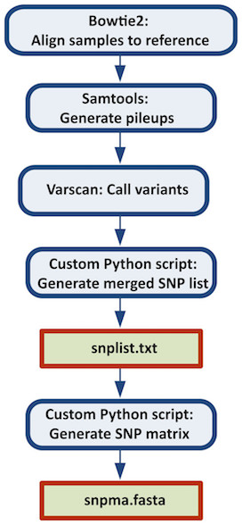

# Examples

##  A pipeline used on epidemiological surveillance 

In this section we present a pipeline used on epidemiological surveillance.
The aim is to characterize bacterial strains through allelic profiles . 
When sequencing a bacterial strain by paired end methods with desired depth of coverage of 100x 
(in average each position in the genome will be covered by 100 reads), the output from the sequencer 
will be two FASTQ files containing the reads. Each read typically will have 90-250 nucleotides length, 
using Illumina technology. The first data processing step is to trim the reads for removing the adapters 
used in the sequencing process and any tags used to identify the experiment in a run.

In de novo assembly, software such as Velvet is used to obtain a draft genome composed of contigs, 
longer DNA sequences resulting from assembling multiple reads. 
The draft genome can be compared to databases of gene alleles for multiple loci using BLAST.
 Given BLAST results we can create an allelic profile characterizing the strain.


```
Pipeline "Github" "https://github.com/ngspipes/tools" {
  tool "Trimmomatic" "DockerConfig" {
    command "trimmomatic" {
      argument "mode" "SE"
      argument "quality" "-phred33"
      argument "inputFile" "ERR406040.fastq"
      argument "outputFile" "ERR406040.filtered.fastq"
      argument "fastaWithAdaptersEtc" "adapters/TruSeq3-SE.fa"
      argument "seed mismatches" "2"
      argument "palindrome clip threshold" "30"
      argument "simple clip threshold" "10"
      argument "windowSize" "4"
      argument "requiredQuality" "15"
      argument "leading quality" "3"
      argument "trailing quality" "3"
      argument "minlen length" "36"
    }
 }
  tool "Velvet" "DockerConfig" {
    command "velveth" {
      argument "output_directory" "velvetdir"
      argument "hash_length" "21"
      argument "file_format" "-fastq"
      chain "filename" "outputFile"
    }
    command "velvetg" {
      argument "output_directory" "velvetdir"
      argument "-cov_cutoff" "5"
    }
  }
  tool "Blast" "DockerConfig" {
    command "makeblastdb" {
      argument "-dbtype" "prot"
      argument "-out" "allrefs"
      argument "-title" "allrefs"
      argument "-in" "allrefs.fna.pro"
    }
    command "blastx" {
      chain "-db" "-out"
      chain "-query" "Velvet" "velvetg" "contigs_fa"
      argument "-out" "blast.out"
    }
  }
}
```
**Example 6.1: A pipeline used on epidemiological surveillance.**

A visual representation of this pipeline described in Example 6.1 is presented in the Figure 6.1. 
Moreover, in this figure is also possible to observe other execution orders that are feasible 
to execute this pipeline in the engine for workstation.


**Figure 6.1: Visual representation of the execution, in the engine for workstation, of the pipeline described in Example 6.1.**

In the engine for cloud, different steps of the pipeline can be  executed in different machines, it is only necessary to respect its depedencies, as it is shown in the Figure 2.2.


**Figure 6.2: Visual representation of the execution, in the engine for cloud, of the pipeline described in Example 6.1.**

## A pipeline used on ChiP-Seq analysis 

In this section we present a pipeline used on ChiP-Seq analysis. This 
 pipeline includes mapping with bowtie2, converting the output to bam format, sorting the bam file, creating a bam index file, running flagstat command, and removing duplicates with picard. So, this pipeline can be used in a ChiP-Seq pipeline that uses the resulting bam file for peak calling and creating heatmaps. Since those steps are generic that can be used for ATAC-Seq analysis too.  


```
Pipeline "Github" "https://github.com/ngspipes/tools" {
	tool "Bowtie2" "DockerConfig" {
		command "bowtie2-build" {
			argument "reference_in" "sequence.fasta"
			argument "bt2_base" "sequence"
		}
	}
	tool "Bowtie2" "DockerConfig" {
		command "bowtie2" {
			argument "-U" "SRR386886.fastq"
			argument "-x" "sequence"
			argument "--trim3" "1"
			argument "-S" "eg2.sam"
		}
	}
	tool "SAMTools" "DockerConfig" {
		command "view" {
			argument "-b" "-b"
			argument "-o" "eg2.bam"
			chain "input" "-S"
		}
	}
	tool "SAMTools" "DockerConfig" {
		command "sort" {
			argument "-o" "eg2.sorted.bam"
			chain "input" "-o"
		}
	}
	tool "Picard" "DockerConfig" {
		command "MarkDuplicates" {
			chain "INPUT" "-o"
			argument "OUTPUT" "marked_duplicates.bam"
			argument "REMOVE_DUPLICATES" "true"
			argument "METRICS_FILE" "metrics.txt"
		}
	}
}
```
**Example 6.2: A pipeline used on ChiP-Seq analysis.**

A visual representation of this pipeline is presented in the next figure.


**Figure 6.2: Visual representation of the execution, in both engines, of the pipeline described in Example 6.2.**

## A pipeline using listing tools (for executing only with Engine for Cloud)

A specific use of NGS data in public health is the determination of the relationship between samples potentially
 associated with a foodborne pathogen outbreak. This relationship can be determined from the phylogenetic analysis 
 of a DNA sequence alignment containing only variable positions, which we refer to as a SNP matrix. The applications
  of such a matrix include inferring a phylogeny for systematic studies and determining within traceback investigations
   whether a clinical sample is significantly different from environmental/product samples.

This case study is a pipeline which combines all the steps necessary to construct a reference-based SNP matrix
 from an NGS sample data set.The pipeline starts with the mapping of NGS reads to a reference genome using Bowtie2,
  then it continues with the processing of those mapping (BAM) files using SAMtools, identification of variant sites 
  using VarScan3, and ends with the production of a SNP matrix using custom Python scripts (calling of SNPs at each variant
   site, combining the SNPs into a SNP matrix). The Python scripts are reused from 
   the _CFSAN SNP Pipeline: an automated method for constructing SNP matrices from next-generation sequence data. PeerJ Computer Science 1:e20 https://doi.org/10.7717/peerj-cs.20._
As it can be observed in this data set, there are four samples, whose dataflow process is more detailed in the [documentation page](http://snp-pipeline.readthedocs.io/en/latest/dataflow.html) of this pipeline.


```
Pipeline "Github" "https://github.com/Vacalexis/tools" {
	tool "snp-pipeline" "DockerConfig" {
		command "create_sample_dirs" {
			argument "-d" "snp-pipeline-master/snppipeline/data/lambdaVirusInputs/samples/*"
			argument "--output" "snp-pipeline-master/snppipeline/data/lambdaVirusInputs/sampleDirectories.txt"
		}
	}

	tool "Bowtie2" "DockerConfig" {
		command "bowtie2-build" {
	  		argument "reference_in" "snp-pipeline-master/snppipeline/data/lambdaVirusInputs/reference/lambda_virus.fasta"
	  		argument "bt2_base" "reference"
		}
		command "bowtie2" {
	  		argument "-p" "1"
	  		argument "-q" "-q"
	  		argument "-x" "reference"
	  		argument "-1" "snp-pipeline-master/snppipeline/data/lambdaVirusInputs/samples/sample1/sample1_1.fastq"
	 		argument "-2" "snp-pipeline-master/snppipeline/data/lambdaVirusInputs/samples/sample1/sample1_2.fastq"
	  		argument "-S" "snp-pipeline-master/snppipeline/data/lambdaVirusInputs/reads1.sam"
		}
		command "bowtie2" {
	  		argument "-p" "1"
	  		argument "-q" "-q"
	  		argument "-x" "reference"
	  		argument "-1" "snp-pipeline-master/snppipeline/data/lambdaVirusInputs/samples/sample2/sample2_1.fastq"
	  		argument "-2" "snp-pipeline-master/snppipeline/data/lambdaVirusInputs/samples/sample2/sample2_2.fastq"
	  		argument "-S" "snp-pipeline-master/snppipeline/data/lambdaVirusInputs/reads2.sam"
		}
		command "bowtie2" {
	  		argument "-p" "1"
	  		argument "-q" "-q"
	  		argument "-x" "reference"
	  		argument "-1" "snp-pipeline-master/snppipeline/data/lambdaVirusInputs/samples/sample3/sample3_1.fastq"
	  		argument "-2" "snp-pipeline-master/snppipeline/data/lambdaVirusInputs/samples/sample3/sample3_2.fastq"
	  		argument "-S" "snp-pipeline-master/snppipeline/data/lambdaVirusInputs/reads3.sam"
		}
		command "bowtie2" {
	  		argument "-p" "1"
	 		argument "-q" "-q"
	 		argument "-x" "reference"
			argument "-1" "snp-pipeline-master/snppipeline/data/lambdaVirusInputs/samples/sample4/sample4_1.fastq"
			argument "-2" "snp-pipeline-master/snppipeline/data/lambdaVirusInputs/samples/sample4/sample4_2.fastq"
	  		argument "-S" "snp-pipeline-master/snppipeline/data/lambdaVirusInputs/reads4.sam"
		}
	
	}
	tool "Listing" "DockerConfig" {
		command "startListing" {
			argument "referenceName" "reads.sam"
			argument "filesList" "snp-pipeline-master/snppipeline/data/lambdaVirusInputs/reads1.sam snp-pipeline-master/snppipeline/data/lambdaVirusInputs/reads2.sam snp-pipeline-master/snppipeline/data/lambdaVirusInputs/reads3.sam snp-pipeline-master/snppipeline/data/lambdaVirusInputs/reads4.sam"
		}
	}
	tool "Samtools" "DockerConfig" {
  
    		command "view" {
	  		argument "-b" "-b"
	  		argument "-S" "-S"
	  		argument "-F" "4"
	  		argument "-o" "reads.unsorted.bam"
	  		argument "input" "reads.sam"
		}
    		command "sort" {
	  		argument "-o" "reads.sorted.bam"
	  		argument "input" "reads.unsorted.bam"
		}
		command "mpileup" {
	  		argument "--fasta-ref" "snp-pipeline-master/snppipeline/data/lambdaVirusInputs/reference/lambda_virus.fasta"
	  		argument "input" "reads.sorted.bam"
	  		argument "--output" "reads.pileup"
		}
	}
	tool "VarScan" "DockerConfig" {
  		command "mpileup2snp" {
	  		argument "mpileupFile" "reads.pileup"
	  		argument "--min-var-freq" "0.90"
	  		argument "--output-vcf" "1"
	  		argument "output" "var.flt.vcf"
		}
	}
	tool "Listing" "DockerConfig" {
		command "stopListing" {
			argument "referenceName" "var.flt.vcf"
			argument "destinationFiles" "snp-pipeline-master/snppipeline/data/lambdaVirusInputs/samples/sample1/var.flt.vcf snp-pipeline-master/snppipeline/data/lambdaVirusInputs/samples/sample2/var.flt.vcf snp-pipeline-master/snppipeline/data/lambdaVirusInputs/samples/sample3/var.flt.vcf snp-pipeline-master/snppipeline/data/lambdaVirusInputs/samples/sample4/var.flt.vcf"
		}
	}
	tool "snp-pipeline" "DockerConfig" {
		command "create_snp_list" {
	  		argument "--vcfname" "var.flt.vcf"
	  		argument "--output" "snp-pipeline-master/snppipeline/data/lambdaVirusInputs/snplist.txt"
	  		argument "sampleDirsFile" "snp-pipeline-master/snppipeline/data/lambdaVirusInputs/sampleDirectories.txt"
		}
	}
	tool "Listing" "DockerConfig" {
		command "restartListing" {
			argument "referenceName" "reads.pileup"
		}
	}
	tool "snp-pipeline" "DockerConfig" {
		command "call_consensus" {
	 		argument "--snpListFile" "snp-pipeline-master/snppipeline/data/lambdaVirusInputs/snplist.txt"
	  		argument "--output" "consensus.fasta"
	  		argument "--vcfFileName" "consensus.vcf "
	  		argument "allPileupFile" "reads.pileup"
		}
	}
	tool "Listing" "DockerConfig" {
		command "stopListing" {
			argument "referenceName" "consensus.fasta"
			argument "destinationFiles" "snp-pipeline-master/snppipeline/data/lambdaVirusInputs/samples/sample1/consensus.fasta snp-pipeline-master/snppipeline/data/lambdaVirusInputs/samples/sample2/consensus.fasta snp-pipeline-master/snppipeline/data/lambdaVirusInputs/samples/sample3/consensus.fasta snp-pipeline-master/snppipeline/data/lambdaVirusInputs/samples/sample4/consensus.fasta"
		}
	}
	tool "snp-pipeline" "DockerConfig" {
		command "create_snp_matrix" {
	  		argument "sampleDirsFile" "snp-pipeline-master/snppipeline/data/lambdaVirusInputs/sampleDirectories.txt"
	  		argument "--consFileName" "consensus.fasta"
	  		argument "--output" "snp-pipeline-master/snppipeline/data/lambdaVirusInputs/snpma.fasta"
		}
	}
}
```



**Figure 6.3: Figure from Davis S, Pettengill JB, Luo Y, Payne J, Shpuntoff A, Rand H, Strain E. (2015) CFSAN SNP Pipeline: an automated method for constructing SNP matrices from next-generation sequence data. PeerJ Computer Science 1:e20 https://doi.org/10.7717/peerj-cs.20**

## A pipeline using split and join tools (for executing only with Engine for Cloud)

This pipeline is similar to the previous one but, instead of have the samples distributed in distinct files, they are concatenated on the same file by a separator character.
