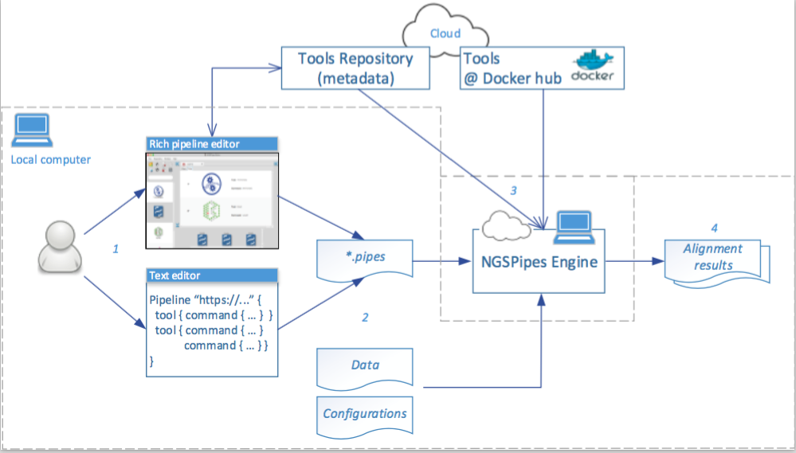

# NGSPipes overview 

**NGSPipes** is a framework to easily design and use pipelines, relying on state of the art cloud technologies to execute them without users need to configure, install and manage tools, servers and complex workflow management systems. 

