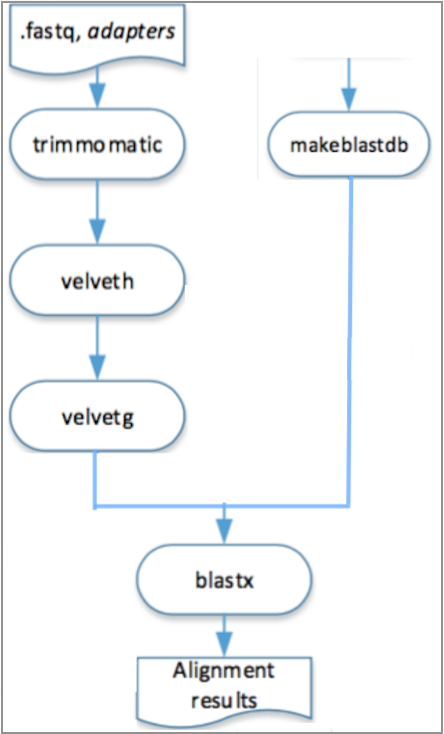

# Running Examples

## A pipeline used on epidemiological surveillance


In this section we present a pipeline used on epidemiological surveillance.
The aim is to characterize bacterial strains through allelic profiles . 
When sequencing a bacterial strain by paired end methods with desired depth of coverage of 100x 
(in average each position in the genome will be covered by 100 reads), the output from the sequencer 
will be two FASTQ files containing the reads. Each read typically will have 90-250 nucleotides length, 
using Illumina technology. The first data processing step is to trim the reads for removing the adapters 
used in the sequencing process and any tags used to identify the experiment in a run.

In de novo assembly, software such as Velvet is used to obtain a draft genome composed of contigs, 
longer DNA sequences resulting from assembling multiple reads. 
The draft genome can be compared to databases of gene alleles for multiple loci using BLAST.
 Given BLAST results we can create an allelic profile characterizing the strain.


```
Pipeline "Github" "https://github.com/ngspipes/tools" {
  tool "Trimmomatic" "DockerConfig" {
    command "trimmomatic" {
      argument "mode" "SE"
      argument "quality" "-phred33"
      argument "inputFile" "study1/ERR406040.fastq"
      argument "outputFile" "ERR406040.filtered.fastq"
      argument "fastaWithAdaptersEtc" "study1/TruSeq3-SE.fa"
      argument "seed mismatches" "2"
      argument "palindrome clip threshold" "30"
      argument "simple clip threshold" "10"
      argument "windowSize" "4"
      argument "requiredQuality" "15"
      argument "leading quality" "3"
      argument "trailing quality" "3"
      argument "minlen length" "36"
    }
 }
  tool "Velvet" "DockerConfig" {
    command "velveth" {
      argument "output_directory" "velvetdir"
      argument "hash_length" "21"
      argument "file_format" "-fastq"
      chain "filename" "outputFile"
    }
    command "velvetg" {
      argument "output_directory" "velvetdir"
      argument "-cov_cutoff" "5"
    }
  }
  tool "Blast" "DockerConfig" {
    command "makeblastdb" {
      argument "-dbtype" "prot"
      argument "-out" "allrefs"
      argument "-title" "allrefs"
      argument "-in" "study1/allrefs.fna.pro"
    }
    command "blastx" {
      chain "-db" "-out"
      chain "-query" "Velvet" "velvetg" "contigs_fa"
      argument "-out" "blast.out"
    }
  }
}
```
**Example 6.1: A pipeline used on epidemiological surveillance.**

A visual representation of this pipeline described in Example 6.1 is presented in the Figure 6.1. 
Moreover, in this figure is also possible to observe other execution orders that are feasible 
to execute this pipeline in the engine for workstation.


**Figure 6.1: Visual representation of the execution, in the engine for workstation, of the pipeline described in Example 6.1.**

In the engine for cloud, different steps of the pipeline can be  executed in different machines, it is only necessary to respect its depedencies, as it is shown in the Figure 2.2.



**Figure 6.2: Visual representation of the execution, in the engine for cloud, of the pipeline described in Example 6.1.**

**Input data is available [here](https://www.dropbox.com/s/h8e8t3prt9f0gq3/study1.zip?dl=0
).**

### Running this example in Engine for workstation

**Note** Please, be sure that the Engine for Workstation is already installed. For this, follow the steps that are in section:

``Engine->Engine for Workstation-> Install engine for workstation.``


Since the engine for workstation is provided as a console application or a graphical user interface application, we will describe how to do with the console application (for more information on how to user the graphical user interface, please look at the section: ``Engine->Engine for Workstation-> Run engine for workstation.``

* After the installation, you should have the following tree file:

```
  WD
    |-- engine-1.0\
       |-- NGSPipesEngineExecutor\ 
          |-- NGSPipesEngineExecutor.vbox
          |-- NGSPipesEngineExecutor.vdi
       |-- bin\
          |-- engine        (CUI OSX/Linux run script)
          |-- engine.bat    (CUI Window run script)
          |-- engine-ui     (GUI OSX/Linux run script)
          |-- engine-ui.bat (GUI Window run script)
       |-- lib\
          |-- ...
    |-- (other files, ...)

```
* Download the data available [here](https://www.dropbox.com/s/h8e8t3prt9f0gq3/study1.zip?dl=0
) 

* After unzipping, the directory content look like, for instance,

```
/home/ngspipes/study1
   |-- allrefs.fna.pro 
   |-- ERR406040.fastq
   |-- NexteraPE-PE.fa
   |-- TruSeq2-PE.fa
   |-- TruSeq2-SE.fa   
   |-- TruSeq3-SE.fa
   |-- TruSeq3-PE-2.fa
   |-- TruSeq3-PE.fa
   |-- TruSeq3-SE.fa 
```
* Create a file  ```casestudy1.pipes```(```.pipes```is the extension containing the pipeline previously described in Figure 6.1. Assume that, on the following
```casestudy1.pipes``` is inside the directory ```study1```.

* Create the `outputs` directory (`/home/ngspipes/outputs`)
* Execute the *engine* at your working directory using the following command line:

##### Windows
``c:\ngspipes>engine-1.0\bin\engine.bat -in c:\ngspipes\study1 -out c:\ngspipes\outputs -pipes c:\ngspipes\casestudy1.pipes``

##### OSX/Linux
``ngs@server:/home/ngspipes$engine-1.0/bin/engine -in /home/ngspipes/inputs -out /home/ngspipes/outputs -pipes /home/ngspipes/casestudy1.pipes``

##### Example and description of output messages

Initial steps of the output will look like this:

```
Loading engine directories
Loading engine resources
Using classpath C:/Users/user/NGSPipes/Engine/dsl-1.0.jar;
               C:/Users/user/NGSPipes/Engine/repository-1.0.jar
Getting engine requirements
Getting clone engine
Clonning engine
...... Clonning engine
...... Clonning engine
...... Clonning engine
...... Clonning engine
...... Clonning engine
...... Clonning engine
Configurating engine
Starting execute engine
Booting engine and installing necessary packages
...
```

Note that the cloning step only happens in the first execution of the engine. On the other hand, when a tool is used for the first in any *pipeline*, the engine will automatically download and install the corresponding Docker image. An example of output for when this is necessary is presented for the *Trimmomatic* tool:

```
...
TRACE    :: STARTED ::
TRACE   Running -> Step : 1 Tool : Trimmomatic Command : trimmomatic
INFO    Executing : sudo docker run -v /home/ngspipes/Inputs/:/shareInputs/:rw -v 
                            /home/ngspipes/Outputs/:/shareOutputs/:rw  
                        ngspipes/trimmomatic0.33 java -jar trimmomatic-0.33.jar SE 
                        -phred33 /shareInputs/ERR406040.fastq /shareOutputs
                        ERR406040.filtered.fastq  
                        ILLUMINACLIP:/shareInputs/adapters/TruSeq3-SE.fa:2:30:10
                        SLIDINGWINDOW:4:15 LEADING:3 TRAILING:3   MINLEN:36
INFO    Unable to find image 'ngspipes/trimmomatic0.33:latest' locally
INFO    latest: Pulling from ngspipes/trimmomatic0.33
INFO    511136ea3c5a: Pulling fs layer
INFO    e977d53b9210: Pulling fs layer
INFO    c9fa20ecce88: Pulling fs layer
...
INFO    6cf3f4911f80: Download complete
INFO    Digest: sha256:44f1dea760903cdce1d75c4c9b2bd37803be2e0fbbb9e960cd8ff27048cbb997
INFO    Status: Downloaded newer image for ngspipes/trimmomatic0.33:latest
INFO    TrimmomaticSE: Started with arguments: -phred33 /shareInputs/ERR406040.fastq 
                            / shareOutputs/ERR406040.filtered.fastq 
                            ILLUMINACLIP:/shareInputs/adapters/TruSeq3-SE.fa:2:30:10 
                            SLIDINGWINDOW:4:15 LEADING:3 TRAILING:3 MINLEN:36
...
```

Note that this tool was previously *dockerized* by the NGSPipes team. For other tools, such as Velvet or Blast, there is already public Docker images which the example pipeline uses. 

When the execution finish, the following files will be at the working directory:

```
home/ngspipes/outputs
   |-- allrefs.phr
   |-- allrefs.pin
   |-- allrefs.psq
   |-- blast.out
   |-- filtered.fastq
   |-- velvetdir/
      |-- Log
      |-- Roadmaps
      |-- Sequences
      |-- contigs.fa
      |-- LastGrpah
      |-- stats.txt
```

### Running this example in Engine for Cloud

**Note** Please, be sure that the Engine for Cloud is already installed. For this, follow the steps that are in section:

``Engine->Engine for Cloud-> Install engine for cloud.``

After the installlation, you should have the following tree file:

```
  WorkingDirectory
    |-- Analyser\
       |-- ngs4cloud-analyser-1.0-SNAPSHOT\ 
          |-- bin
              |--ngs4cloud-analyser
              |--ngs4cloud-analyser.bat (CUI Window run script)
    |-- Monitor\
       |-- monitor.jar         
    |-- (other files,...)
```
* **Input data is available [here](https://www.dropbox.com/s/h8e8t3prt9f0gq3/study1.zip?dl=0
).**, but is not necessary to download. Input data in Engine for Cloud engine is always passed as an URI.

* Create a file  ```casestudy1.pipes```(```.pipes```is the extension containing the pipeline previously described in Figure 6.1. Assume that, on the following,
```casestudy1.pipes``` is inside the directory ```ngs4cloud-analyser-1.0-SNAPSHOT```.

* Start by execution the analyser tool, in order to produce an file with ```json```extension. 

##### OSX/Linux
```
ngs@server:ngs4cloud-analyser-1.0-SNAPSHOT$ ./bin/ngs4cloud-analyser analyse 
    -pipes casestudy1.pipes 
    -ir ir1.json 
    -input https://www.dropbox.com/s/h8e8t3prt9f0gq3/study1.zip?dl=0 
    -outputs blast.out velvetdir/contigs.fa
```
* This execution will produce the file ```ir1.json```.

* Then, copy the ```ir1.json``` inside to directory ```Monitor```

* Before executing the Monitor, please assure that the Virtual Machine with the cluster image given for test purposes is lauched and correctly settled (please, see the section 

```
Engine->Engine for cloud->
    Install the engine for cloud -> Install the monitor
```
* Launch the pipeline into the cluster through the monitor command

```
ngs@server:Monitor$ java -jar monitor.jar launch ir1.json
```
* The previous command with generate a pipeline ```id```. Assume in this example that the id is 1.

* Consult the status of the pipeline by its id

```
ngs@server:Monitor$ java -jar monitor.jar status 1
```

* After pipeline is finished, it is possible to download its results from the cluster to a previously defined directory inside the ```Monitor```directory. 

```
ngs@server:Monitor$ java -jar monitor.jar outputs 1 resultsDirectory
```
 
* ```resultsDirectory``` is the directory that contains a copy of the outputs that where previously specified by the analyser that should be copied; ```1``` is the pipeline ```ìd```

For more information about the `analyser`  and `monitor` commands and its parameters, please see section

```
Engine->Engine for cloud->Run the engine for cloud 
```

## A pipeline used on ChiP-Seq analysis 

In this section we present a pipeline used on ChiP-Seq analysis. This 
 pipeline includes mapping with bowtie2, converting the output to bam format, sorting the bam file, creating a bam index file, running flagstat command, and removing duplicates with picard. So, this pipeline can be used in a ChiP-Seq pipeline that uses the resulting bam file for peak calling and creating heatmaps. Since those steps are generic that can be used for ATAC-Seq analysis too.  


```
Pipeline "Github" "https://github.com/ngspipes/tools" {
    tool "Bowtie2" "DockerConfig" {
        command "bowtie2-build" {
            argument "reference_in" "study2/sequence.fasta"
            argument "bt2_base" "sequence"
        }
    }
    tool "Bowtie2" "DockerConfig" {
        command "bowtie2" {
            argument "-U" "study2/SRR386886.fastq"
            argument "-x" "sequence"
            argument "--trim3" "1"
            argument "-S" "eg2.sam"
        }
    }
    tool "Samtools" "DockerConfig" {
        command "view" {
            argument "-b" "NA"
            argument "-o" "eg2.bam"
            chain "input" "-S"
        }
    }
    tool "Samtools" "DockerConfig" {
        command "sort" {
            argument "-o" "eg2.sorted.bam"
            chain "input" "-o"
        }
    }
    tool "Picard" "DockerConfig" {
        command "MarkDuplicates" {
            chain "INPUT" "-o"
            argument "OUTPUT" "marked_duplicates.bam"
            argument "REMOVE_DUPLICATES" "true"
            argument "METRICS_FILE" "metrics.txt"
        }
    }
}
```
**Example 6.2: A pipeline used on ChiP-Seq analysis.**

A visual representation of this pipeline is presented in the next figure.


**Figure 6.2: Visual representation of the execution, in both engines, of the pipeline described in Example 6.2.**

### Running this example in Engine for workstation

Similar to the prevous example.


### Running this example in Engine for Cloud

It is similar to the previous example.

**Note** Please, be sure that the Engine for Cloud is already installed. For this, follow the steps that are in section:

``Engine->Engine for Cloud-> Install engine for cloud.``

After the installlation, you should have the following tree file:

```
  WorkingDirectory
    |-- Analyser\
       |-- ngs4cloud-analyser-1.0-SNAPSHOT\ 
          |-- bin
              |--ngs4cloud-analyser
              |--ngs4cloud-analyser.bat (CUI Window run script)
    |-- Monitor\
       |-- monitor.jar         
    |-- (other files,...)
```
* **Input data is available [here](https://www.dropbox.com/s/filps3qavvhjta7/study2.zip?dl=0
).**, but is not necessary to download. Input data in Engine for Cloud engine is always passed as an URI.

* Create a file  ```casestudy2.pipes```(```.pipes```is the extension containing the pipeline previously described in Figure 6.2. Assume that, on the following,
```casestudy2.pipes``` is inside the directory ```ngs4cloud-analyser-1.0-SNAPSHOT```.

* Start by execution the analyser tool, in order to produce an file with ```json```extension. 

##### OSX/Linux
```
ngs@server:ngs4cloud-analyser-1.0-SNAPSHOT$ ./bin/ngs4cloud-analyser analyse 
          -pipes casestudy2.pipes 
          -ir ir2.json 
          -input https://www.dropbox.com/s/filps3qavvhjta7/study2.zip?dl=0 
          -outputs metrics.txt
```
* This execution will produce the file ```ir2.json```.

* Then, copy the ```ir2.json``` inside to directory ```Monitor```

* Before executing the Monitor, please assure that the Virtual Machine with the cluster image given for test purposes is lauched and correctly settled (please, see the section 

```
Engine->Engine for cloud->
    Install the engine for cloud -> Install the monitor
```
* Launch the pipeline into the cluster through the monitor command

```
ngs@server:Monitor$ java -jar monitor.jar launch ir2.json
```
* The previous command with generate a pipeline ```id```. Assume in this example that the id is 2.

* Consult the status of the pipeline by its id

```
ngs@server:Monitor$ java -jar monitor.jar status 2
```

* After pipeline is finished, it is possible to download its results from the cluster to a previously defined directory inside the ```Monitor```directory. 

```
ngs@server:Monitor$ java -jar monitor.jar outputs 2 resultsDirectory
```
 
* ```resultsDirectory``` is the directory that contains a copy of the outputs that where previously specified by the analyser that should be copied; ```2``` is the pipeline ```ìd```

For more information about the `analyser`  and `monitor` commands and its parameters, please see section

```
Engine->Engine for cloud->Run the engine for cloud 
```


## A pipeline using listing tools 

A specific use of NGS data in public health is the determination of the relationship between samples potentially
 associated with a foodborne pathogen outbreak. This relationship can be determined from the phylogenetic analysis 
 of a DNA sequence alignment containing only variable positions, which we refer to as a SNP matrix. The applications
  of such a matrix include inferring a phylogeny for systematic studies and determining within traceback investigations
   whether a clinical sample is significantly different from environmental/product samples.

This case study is a pipeline which combines all the steps necessary to construct a reference-based SNP matrix
 from an NGS sample data set.The pipeline starts with the mapping of NGS reads to a reference genome using Bowtie2,
  then it continues with the processing of those mapping (BAM) files using SAMtools, identification of variant sites 
  using VarScan3, and ends with the production of a SNP matrix using custom Python scripts (calling of SNPs at each variant
   site, combining the SNPs into a SNP matrix). The Python scripts are reused from 
   the _CFSAN SNP Pipeline: an automated method for constructing SNP matrices from next-generation sequence data. PeerJ Computer Science 1:e20 https://doi.org/10.7717/peerj-cs.20._
As it can be observed in this data set, there are four samples, whose dataflow process is more detailed in the [documentation page](http://snp-pipeline.readthedocs.io/en/latest/dataflow.html) of this pipeline.


```
Pipeline "Github" "https://github.com/Vacalexis/tools" {
	tool "snp-pipeline" "DockerConfig" {
		command "create_sample_dirs" {
			argument "-d" "snp-pipeline-master/snppipeline/data/lambdaVirusInputs/samples/*"
			argument "--output" "snp-pipeline-master/snppipeline/data/lambdaVirusInputs/sampleDirectories.txt"
		}
	}

	tool "Bowtie2" "DockerConfig" {
		command "bowtie2-build" {
	  		argument "reference_in" "snp-pipeline-master/snppipeline/data/lambdaVirusInputs/reference/lambda_virus.fasta"
	  		argument "bt2_base" "reference"
		}
		command "bowtie2" {
	  		argument "-p" "1"
	  		argument "-q" "-q"
	  		argument "-x" "reference"
	  		argument "-1" "snp-pipeline-master/snppipeline/data/lambdaVirusInputs/samples/sample1/sample1_1.fastq"
	 		argument "-2" "snp-pipeline-master/snppipeline/data/lambdaVirusInputs/samples/sample1/sample1_2.fastq"
	  		argument "-S" "snp-pipeline-master/snppipeline/data/lambdaVirusInputs/reads1.sam"
		}
		command "bowtie2" {
	  		argument "-p" "1"
	  		argument "-q" "-q"
	  		argument "-x" "reference"
	  		argument "-1" "snp-pipeline-master/snppipeline/data/lambdaVirusInputs/samples/sample2/sample2_1.fastq"
	  		argument "-2" "snp-pipeline-master/snppipeline/data/lambdaVirusInputs/samples/sample2/sample2_2.fastq"
	  		argument "-S" "snp-pipeline-master/snppipeline/data/lambdaVirusInputs/reads2.sam"
		}
		command "bowtie2" {
	  		argument "-p" "1"
	  		argument "-q" "-q"
	  		argument "-x" "reference"
	  		argument "-1" "snp-pipeline-master/snppipeline/data/lambdaVirusInputs/samples/sample3/sample3_1.fastq"
	  		argument "-2" "snp-pipeline-master/snppipeline/data/lambdaVirusInputs/samples/sample3/sample3_2.fastq"
	  		argument "-S" "snp-pipeline-master/snppipeline/data/lambdaVirusInputs/reads3.sam"
		}
		command "bowtie2" {
	  		argument "-p" "1"
	 		argument "-q" "-q"
	 		argument "-x" "reference"
			argument "-1" "snp-pipeline-master/snppipeline/data/lambdaVirusInputs/samples/sample4/sample4_1.fastq"
			argument "-2" "snp-pipeline-master/snppipeline/data/lambdaVirusInputs/samples/sample4/sample4_2.fastq"
	  		argument "-S" "snp-pipeline-master/snppipeline/data/lambdaVirusInputs/reads4.sam"
		}
	
	}
	tool "Listing" "DockerConfig" {
		command "startListing" {
			argument "referenceName" "reads.sam"
			argument "filesList" "snp-pipeline-master/snppipeline/data/lambdaVirusInputs/reads1.sam snp-pipeline-master/snppipeline/data/lambdaVirusInputs/reads2.sam snp-pipeline-master/snppipeline/data/lambdaVirusInputs/reads3.sam snp-pipeline-master/snppipeline/data/lambdaVirusInputs/reads4.sam"
		}
	}
	tool "Samtools" "DockerConfig" {
  
    		command "view" {
	  		argument "-b" "-b"
	  		argument "-S" "-S"
	  		argument "-F" "4"
	  		argument "-o" "reads.unsorted.bam"
	  		argument "input" "reads.sam"
		}
    		command "sort" {
	  		argument "-o" "reads.sorted.bam"
	  		argument "input" "reads.unsorted.bam"
		}
		command "mpileup" {
	  		argument "--fasta-ref" "snp-pipeline-master/snppipeline/data/lambdaVirusInputs/reference/lambda_virus.fasta"
	  		argument "input" "reads.sorted.bam"
	  		argument "--output" "reads.pileup"
		}
	}
	tool "VarScan" "DockerConfig" {
  		command "mpileup2snp" {
	  		argument "mpileupFile" "reads.pileup"
	  		argument "--min-var-freq" "0.90"
	  		argument "--output-vcf" "1"
	  		argument "output" "var.flt.vcf"
		}
	}
	tool "Listing" "DockerConfig" {
		command "stopListing" {
			argument "referenceName" "var.flt.vcf"
			argument "destinationFiles" "snp-pipeline-master/snppipeline/data/lambdaVirusInputs/samples/sample1/var.flt.vcf snp-pipeline-master/snppipeline/data/lambdaVirusInputs/samples/sample2/var.flt.vcf snp-pipeline-master/snppipeline/data/lambdaVirusInputs/samples/sample3/var.flt.vcf snp-pipeline-master/snppipeline/data/lambdaVirusInputs/samples/sample4/var.flt.vcf"
		}
	}
	tool "snp-pipeline" "DockerConfig" {
		command "create_snp_list" {
	  		argument "--vcfname" "var.flt.vcf"
	  		argument "--output" "snp-pipeline-master/snppipeline/data/lambdaVirusInputs/snplist.txt"
	  		argument "sampleDirsFile" "snp-pipeline-master/snppipeline/data/lambdaVirusInputs/sampleDirectories.txt"
		}
	}
	tool "Listing" "DockerConfig" {
		command "restartListing" {
			argument "referenceName" "reads.pileup"
		}
	}
	tool "snp-pipeline" "DockerConfig" {
		command "call_consensus" {
	 		argument "--snpListFile" "snp-pipeline-master/snppipeline/data/lambdaVirusInputs/snplist.txt"
	  		argument "--output" "consensus.fasta"
	  		argument "--vcfFileName" "consensus.vcf "
	  		argument "allPileupFile" "reads.pileup"
		}
	}
	tool "Listing" "DockerConfig" {
		command "stopListing" {
			argument "referenceName" "consensus.fasta"
			argument "destinationFiles" "snp-pipeline-master/snppipeline/data/lambdaVirusInputs/samples/sample1/consensus.fasta snp-pipeline-master/snppipeline/data/lambdaVirusInputs/samples/sample2/consensus.fasta snp-pipeline-master/snppipeline/data/lambdaVirusInputs/samples/sample3/consensus.fasta snp-pipeline-master/snppipeline/data/lambdaVirusInputs/samples/sample4/consensus.fasta"
		}
	}
	tool "snp-pipeline" "DockerConfig" {
		command "create_snp_matrix" {
	  		argument "sampleDirsFile" "snp-pipeline-master/snppipeline/data/lambdaVirusInputs/sampleDirectories.txt"
	  		argument "--consFileName" "consensus.fasta"
	  		argument "--output" "snp-pipeline-master/snppipeline/data/lambdaVirusInputs/snpma.fasta"
		}
	}
}
```


**Figure 6.3: Figure from Davis S, Pettengill JB, Luo Y, Payne J, Shpuntoff A, Rand H, Strain E. (2015) CFSAN SNP Pipeline: an automated method for constructing SNP matrices from next-generation sequence data. PeerJ Computer Science 1:e20 https://doi.org/10.7717/peerj-cs.20**

### Running this example in Engine for Cloud

[//]: # ( ##A pipeline using split and join tools (for executing only with Engine for Cloud) )

[//]: # (This pipeline is similar to the previous one but, instead of have the samples distributed in distinct files, they are concatenated on the same file by a separator character.)
